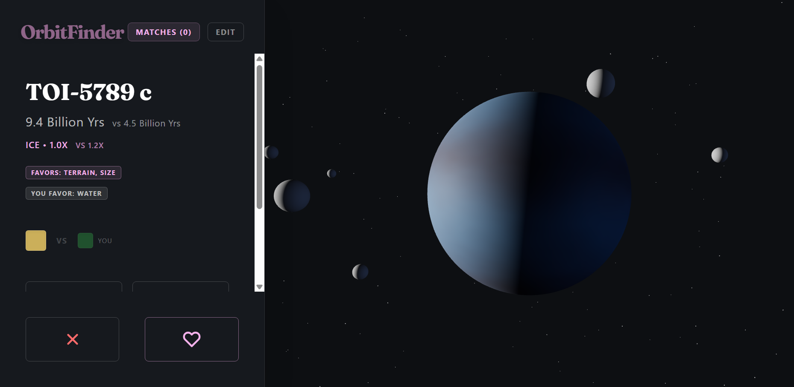

# Orbit Finder

A matchmaker for lonely planets.



This project was made for [Horizons Polaris](https://horizons.hackclub.com/polaris).
Our prompt was "_Even wandering planets have a destination._"

Made with Vite, React, 3.js, and firebase.

**Try it out at https://orbit-finder.vercel.app !**

## Installation

1. Clone the repo
```shell
git clone https://github.com/Tinkering-Townsperson/OrbitFinder.git
cd OrbitFinder
```

2. Install dependencies
```shell
npm install
```

3. Start the development server on `localhost:5173`
```shell
npm run dev
```

4. Build the site to `/dist`
```shell
npm run build
```

## Features

### Design page
The design page allows users to create their planet "dating profile",
editing the traits and characteristics of their planet. It also exposes
the functionality to publish their planet and enter it into the dating
pool for others to possibly encounter.

### Match page
The match page is the equivalent of a "swiping" interface found in most
dating apps. It shows a candidate planet, with the rendering in place of
profile photos, along with some traits with your own traits side by side
for quick comparison. The user can then "match" with or "reject" each
candidate. Should the user choose to match, the candidate may accept their
request or decline it based on a semi-random event. Once the user's planet
matches with another planet, we can rest assured that the planets will enjoy
their "happily-ever-after"!

### Explore page
The explore page allows you to scroll through other users' creations. It
fetches the json data for the planets from firebase in a paginated manner.
